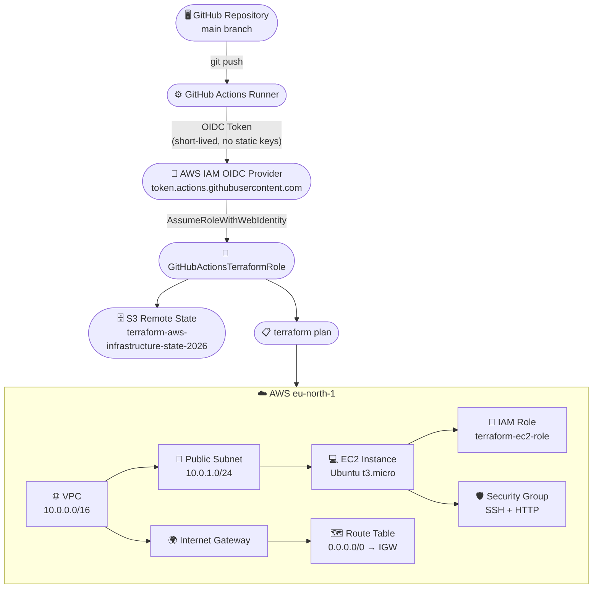
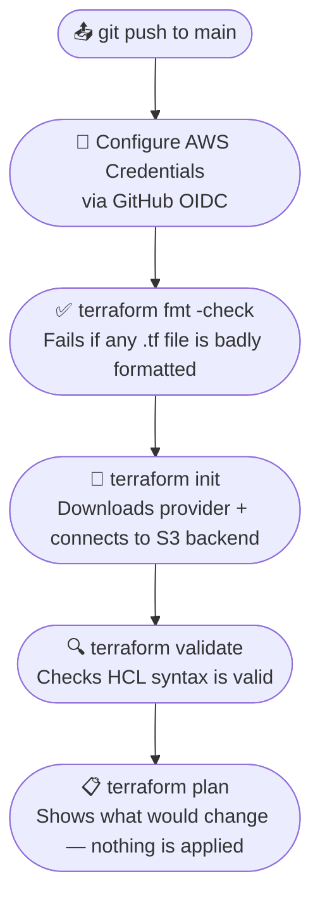
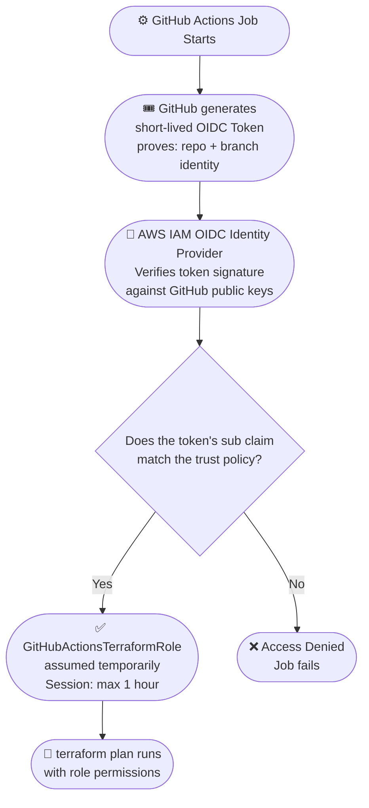

# Terraform AWS Infrastructure

A hands-on Infrastructure as Code project where I provisioned and managed real AWS infrastructure using Terraform. The project includes networking, compute, IAM, remote state management, and a CI pipeline with GitHub Actions using OIDC-based authentication — no static AWS credentials stored anywhere.

---

## Table of Contents

- [Overview](#overview)
- [What I Built](#what-i-built)
- [Tech Stack](#tech-stack)
- [Architecture](#architecture)
- [Project Structure](#project-structure)
- [AWS Infrastructure](#aws-infrastructure)
  - [VPC](#vpc)
  - [Public Subnet](#public-subnet)
  - [Internet Gateway](#internet-gateway)
  - [Route Table](#route-table)
  - [Security Group](#security-group)
  - [EC2 Instance](#ec2-instance)
  - [IAM Role and Instance Profile](#iam-role-and-instance-profile)
  - [S3 Remote State](#s3-remote-state)
- [Terraform Modules](#terraform-modules)
- [Remote State](#remote-state)
- [GitHub Actions CI](#github-actions-ci)
- [AWS OIDC Authentication](#aws-oidc-authentication)
- [IAM Permissions for GitHub Actions](#iam-permissions-for-github-actions)
- [Problems I Faced](#problems-i-faced)
- [Getting Started](#getting-started)
- [What I Learned](#what-i-learned)

---

## Overview

I built this project to get practical experience with Terraform and AWS. Instead of clicking through the AWS console, I wanted to define all my infrastructure in code so it could be version-controlled, reviewed, and reproduced consistently.

The setup covers a realistic (though simple) production-like pattern: isolated networking with a VPC, a compute layer with an EC2 instance, an IAM role attached to the instance, remote Terraform state stored securely in S3, and a CI pipeline that runs `terraform plan` on every push using short-lived OIDC credentials instead of hardcoded AWS keys.

---

## What I Built

| Area | What I Implemented |
|---|---|
| Networking | VPC, Public Subnet, Internet Gateway, Route Table, Route Table Association |
| Compute | Ubuntu 24.04 EC2 instance (`t3.micro`) |
| Security | Security Group with SSH and HTTP ingress rules |
| Identity | IAM Role, Inline Policy, Instance Profile |
| State Management | S3 Remote Backend with versioning, encryption, and public access blocking |
| Modules | Separate `vpc`, `ec2`, and `iam` Terraform modules |
| CI/CD | GitHub Actions workflow — format check, init, validate, plan |
| Authentication | GitHub OIDC — no static AWS access keys |

---

## Tech Stack

| Tool / Service | Version / Notes |
|---|---|
| Terraform | >= 1.6.0 |
| AWS Provider | ~> 6.0 (locked at 6.67.0) |
| AWS Region | `eu-north-1` (Stockholm) |
| EC2 AMI | Ubuntu 24.04 LTS (`ubuntu-noble-24.04-amd64-server-*`) |
| Instance Type | `t3.micro` |
| Remote State | AWS S3 with native lockfile (`use_lockfile = true`) |
| CI | GitHub Actions |
| Auth | AWS IAM OIDC Identity Provider |

---

## Architecture



---

## Project Structure

```
terraform-aws-infrastructure/
|
+-- .github/
|   +-- workflows/
|       +-- terraform.yml        # GitHub Actions CI pipeline
|
+-- modules/
|   +-- ec2/
|   |   +-- main.tf              # EC2 instance resource
|   |   +-- variables.tf         # Input variables (ami_id, instance_type, etc.)
|   |   +-- outputs.tf           # Outputs (instance_id)
|   |
|   +-- iam/
|   |   +-- main.tf              # IAM role, inline policy, instance profile
|   |   +-- variables.tf
|   |   +-- outputs.tf           # Outputs (role_name, instance_profile_name)
|   |
|   +-- vpc/
|       +-- main.tf              # VPC, subnet, IGW, route table
|       +-- variables.tf
|       +-- outputs.tf           # Outputs (vpc_id, subnet_id)
|
+-- main.tf                      # Root module: calls vpc, ec2, iam + S3 + SG
+-- providers.tf                 # AWS provider config and S3 backend
+-- variables.tf                 # Root input variables (instance_type)
+-- outputs.tf                   # Root outputs (vpc_id, instance_id, etc.)
+-- .terraform.lock.hcl          # Provider version lock file
+-- .gitignore                   # Ignores .terraform/, *.tfstate, *.tfvars
```

---

## AWS Infrastructure

### VPC

I created a VPC with the CIDR block `10.0.0.0/16`. This gives me an isolated network in AWS where I can control what traffic comes in and out. Without a VPC, everything would just land in the default AWS network, which is not a good practice.

### Public Subnet

Inside the VPC, I created a public subnet at `10.0.1.0/24` in `eu-north-1a`. I put the EC2 instance here since it needs to be reachable from the internet.

### Internet Gateway

To actually connect the VPC to the internet, I attached an Internet Gateway. Without this, the VPC is completely isolated and nothing can reach the EC2 instance even if the subnet is set up correctly.

### Route Table

I created a route table with a route that sends all outbound traffic (`0.0.0.0/0`) to the Internet Gateway. Then I associated it with the public subnet. This is what makes the subnet "public" — traffic from it can actually reach the internet through the IGW.

### Security Group

I created a security group for the EC2 instance that allows:

- **Port 22 (SSH)** — for remote access
- **Port 80 (HTTP)** — for web traffic
- **All outbound traffic** — so the instance can reach the internet for updates, etc.

### EC2 Instance

I launched a `t3.micro` Ubuntu 24.04 LTS instance. The AMI is looked up dynamically using a `data` source so it always picks the latest Ubuntu image — I don't have to hardcode the AMI ID.

```hcl
data "aws_ami" "ubuntu" {
  most_recent = true
  owners      = ["099720109477"]  # Canonical (Ubuntu publisher)

  filter {
    name   = "name"
    values = ["ubuntu/images/hvm-ssd-gp3/ubuntu-noble-24.04-amd64-server-*"]
  }
}
```

The instance is placed in the public subnet, attached to the security group, and uses the IAM instance profile.

### IAM Role and Instance Profile

I created an IAM role called `terraform-ec2-role` that the EC2 instance can assume. The role has an inline policy that allows the instance to read objects from S3.

To attach a role to an EC2 instance, AWS requires an **Instance Profile** — it's basically a container for the role. So I created `terraform-ec2-profile` and linked the role to it.

### S3 Remote State

I created an S3 bucket (`terraform-aws-infrastructure-state-2026`) to store Terraform's remote state. See the [Remote State](#remote-state) section for full details.

---

## Terraform Modules

Originally I wrote everything in a single `main.tf` file. Once things got bigger, I refactored the code into three separate modules so each area of infrastructure has its own folder and responsibility:

| Module | What it manages |
|---|---|
| `modules/vpc` | VPC, Subnet, Internet Gateway, Route Table |
| `modules/ec2` | EC2 instance |
| `modules/iam` | IAM Role, Inline Policy, Instance Profile |

The root `main.tf` calls each module and passes inputs between them. For example, the EC2 module needs the subnet ID and security group ID, which come from the VPC module and the root module respectively.

### `moved` Blocks

When I moved resources from the root module into the child modules, Terraform would have normally seen them as deleted and recreated — which would have destroyed my existing EC2 instance and VPC. To avoid that, I used Terraform `moved` blocks.

```hcl
moved {
  from = aws_vpc.main
  to   = module.vpc.aws_vpc.main
}
```

These blocks tell Terraform: "this resource hasn't changed in AWS — it's just at a different address in the state file now." Terraform updates the state file without touching the actual cloud resources.

During `terraform plan`, this shows up as `"has moved to module..."` — that's completely expected and means no real infrastructure change happened.

---

## Remote State

By default, Terraform stores state locally in a `terraform.tfstate` file. That works for solo experiments, but it has problems:

- It can't be shared with a CI system like GitHub Actions
- Easy to accidentally lose or corrupt
- No history if something goes wrong

So I configured S3 as the remote backend with the bucket `terraform-aws-infrastructure-state-2026`, the state key `terraform.tfstate`, encryption enabled, and S3-native locking via `use_lockfile = true` (available from Terraform 1.6+ — no DynamoDB table needed).

I also hardened the bucket itself with three additional configurations:

| Feature | Why I added it |
|---|---|
| **Versioning** | Keeps a full history of every state file write, so I can roll back if something gets corrupted |
| **Server-side encryption (AES256)** | The state file contains resource IDs and configuration details — it should always be encrypted at rest |
| **Public access blocking** | The bucket is completely private; no chance of accidentally making it public |

---

## GitHub Actions CI

I set up a GitHub Actions workflow that runs automatically on every push to `main`.

### CI Pipeline Flow



### Pull Request vs Push to Main

The workflow behaves differently depending on how it's triggered:

- **Pull requests** — run `fmt`, `init -backend=false`, and `validate` only. No AWS credentials are issued to PRs. This is intentional: it reduces the attack surface and means PRs can be safely validated without needing AWS access.
- **Push to main** — runs the full pipeline including AWS authentication and `terraform plan`.

---

## AWS OIDC Authentication

I didn't want to store long-lived AWS access keys in GitHub Secrets. If a key ever leaked, it would be valid indefinitely until someone manually rotated it. Instead, I used OpenID Connect (OIDC) — GitHub generates a short-lived signed token for each job, AWS verifies it, and the role is assumed temporarily. No keys to store, no keys to rotate.

### OIDC Authentication Flow



### What I Set Up

To make this work, three things needed to be in place:

1. **IAM OIDC Identity Provider** — registered `token.actions.githubusercontent.com` in AWS IAM so AWS knows to trust GitHub-signed tokens.
2. **Trust Policy on the Role** — restricted to my specific repo and branch using the `sub` claim. Even if someone forks the repo, they can't assume my role.
3. **Workflow Permission** — added `permissions: id-token: write` to the GitHub Actions workflow so GitHub actually generates the OIDC token for the job.

---

## IAM Permissions for GitHub Actions

The `GitHubActionsTerraformRole` uses a least-privilege inline policy with exactly three permission groups:

| Statement | What it allows | Why it's needed |
|---|---|---|
| `TerraformStateAccess` | Read/write the S3 state file; read all bucket properties (`s3:GetBucket*`) | Terraform needs to read and update remote state, and to refresh the `aws_s3_bucket` resource attributes |
| `TerraformEC2Read` | `ec2:Describe*` on all resources | Terraform refreshes VPC, subnet, EC2, security group, and route table state before planning |
| `TerraformIAMRead` | `iam:GetRole`, `iam:GetRolePolicy`, `iam:GetInstanceProfile`, `iam:ListRolePolicies`, `iam:ListAttachedRolePolicies` | Terraform reads the managed IAM role and instance profile during refresh |

The role can **read** existing infrastructure to detect drift, and can **read/write** the state file. It cannot create, modify, or destroy any AWS resource. `terraform apply` is always run manually.

---

## Problems I Faced

This section documents the real issues I ran into while building this project.

### 1. OIDC Authentication Failure

**Problem:** GitHub Actions kept failing at the "Configure AWS Credentials" step with an error saying it couldn't assume `GitHubActionsTerraformRole`.

**Why it happened:** The GitHub OIDC identity provider wasn't configured in AWS at all, so AWS had no way to validate the OIDC token GitHub was sending. The trust policy on the role also had an incorrect subject format.

**What I did:**

- Created the OIDC Identity Provider in AWS IAM for `token.actions.githubusercontent.com`
- Updated the role trust policy to use the correct `sub` claim format tied to my specific repo and branch

**Result:** Authentication started working and the workflow could assume the role and get temporary credentials.

---

### 2. Terraform Plan Kept Failing with AccessDenied

**Problem:** Once authentication worked, `terraform plan` started failing with `AccessDenied` errors from AWS. For example:

```
s3:GetBucketPolicy
ec2:DescribeVpcAttribute
iam:ListRolePolicies
```

**Why it happened:** During `terraform plan`, Terraform refreshes its knowledge of every managed resource by making read API calls to AWS. Terraform's AWS provider (v6.67.0) is thorough about this — it reads many resource attributes including ones I hadn't explicitly configured, like bucket CORS settings, lifecycle policies, and EC2 instance attributes.

The tricky part: whenever Terraform hits an `AccessDenied` error, it stops completely. So each CI run only surfaces the *next* missing permission in the sequence. I couldn't see all the missing permissions at once — I had to fix them one by one, which meant a new CI run for each fix.

**First approach:** I added permissions one by one as each error appeared. It worked but was slow — 5+ CI runs just to discover all the missing read permissions.

**Better approach:** I redesigned the policy more systematically:

- For S3: use `s3:GetBucket*` to cover all read-only bucket property lookups at once
- For EC2: use `ec2:Describe*` since all EC2 Describe calls are read-only and AWS doesn't support resource-level restrictions on them anyway
- For IAM: keep only the specific `Get*` and `List*` calls Terraform actually needs

This resolved all the refresh-phase errors in a single policy update without granting any write permissions.

---

### 3. Terraform Module Refactoring

**Problem:** After moving resources into modules, running `terraform plan` produced a wall of `"has moved to module..."` messages and I wasn't sure if Terraform was going to recreate everything.

**Why it happened:** Terraform tracks resources by their address in the state file. For example, `aws_vpc.main` in the root module becomes `module.vpc.aws_vpc.main` after moving it into a child module. From Terraform's perspective, without explicit instruction, it looks like the original resource was deleted and a new one needs to be created — which would mean destroying my actual VPC and EC2 instance.

**What I did:** Added `moved {}` blocks in `main.tf` for every resource that changed address:

```hcl
moved {
  from = aws_vpc.main
  to   = module.vpc.aws_vpc.main
}
```

**Result:** `Plan: 0 to add, 0 to change, 0 to destroy.` — Terraform updated the state file addresses without making any changes to real AWS resources.

---

## Getting Started

> **Note:** This project provisions real AWS resources that may incur costs. Make sure you have an AWS account and appropriate permissions before proceeding.

### Prerequisites

- [Terraform](https://www.terraform.io/downloads) >= 1.6.0
- AWS CLI installed and configured (`aws configure`)
- An S3 bucket for remote state (or update `providers.tf` to use local state for testing)

### Clone the Repository

```bash
git clone https://github.com/ADDYY27/terraform-aws-infrastructure.git
cd terraform-aws-infrastructure
```

### Initialize Terraform

```bash
terraform init
```

This downloads the AWS provider and connects to the S3 remote backend.

### Check Formatting

```bash
terraform fmt -check -recursive
```

### Validate Configuration

```bash
terraform validate
```

### Preview the Plan

```bash
terraform plan
```

Shows what Terraform would create, change, or destroy — nothing in AWS is modified at this step.

### Apply

```bash
terraform apply
```

> The GitHub Actions CI only runs `terraform plan`. Applying changes is always done manually.

### Destroy

```bash
terraform destroy
```

> Use with caution — this will permanently delete all managed AWS resources.

---

## What I Learned

A few things that stuck with me after building this:

**Terraform state is everything.** If the state file is lost or corrupted, Terraform loses track of what it owns in AWS. Using S3 as a remote backend with versioning and encryption isn't optional in any real project — it's the baseline you should always start with.

**`moved` blocks are the right tool for refactoring.** Restructuring Terraform code into modules feels risky at first because changing a resource's address looks like a deletion to Terraform. Once I understood what `moved` blocks actually do, refactoring became a lot less stressful.

**OIDC is the right way to authenticate CI to AWS.** Static access keys stored in GitHub Secrets are a liability — they're valid indefinitely until you manually rotate them. OIDC tokens expire within an hour and there's nothing to clean up if something goes wrong.

**Terraform's AWS provider reads a lot more than you'd expect during refresh.** The provider checks every attribute of every managed resource before calculating a plan. When building the IAM policy for a CI plan role, granting `ec2:Describe*` and `s3:GetBucket*` upfront is the right call — trying to guess which specific Describe calls the provider makes for each resource version is a slow, painful process.

**Least privilege is about understanding what's needed, not about minimizing everything.** The goal isn't to grant the fewest permissions possible — it's to grant exactly what's needed and nothing more. Getting there requires actually understanding what the tool does under the hood.
