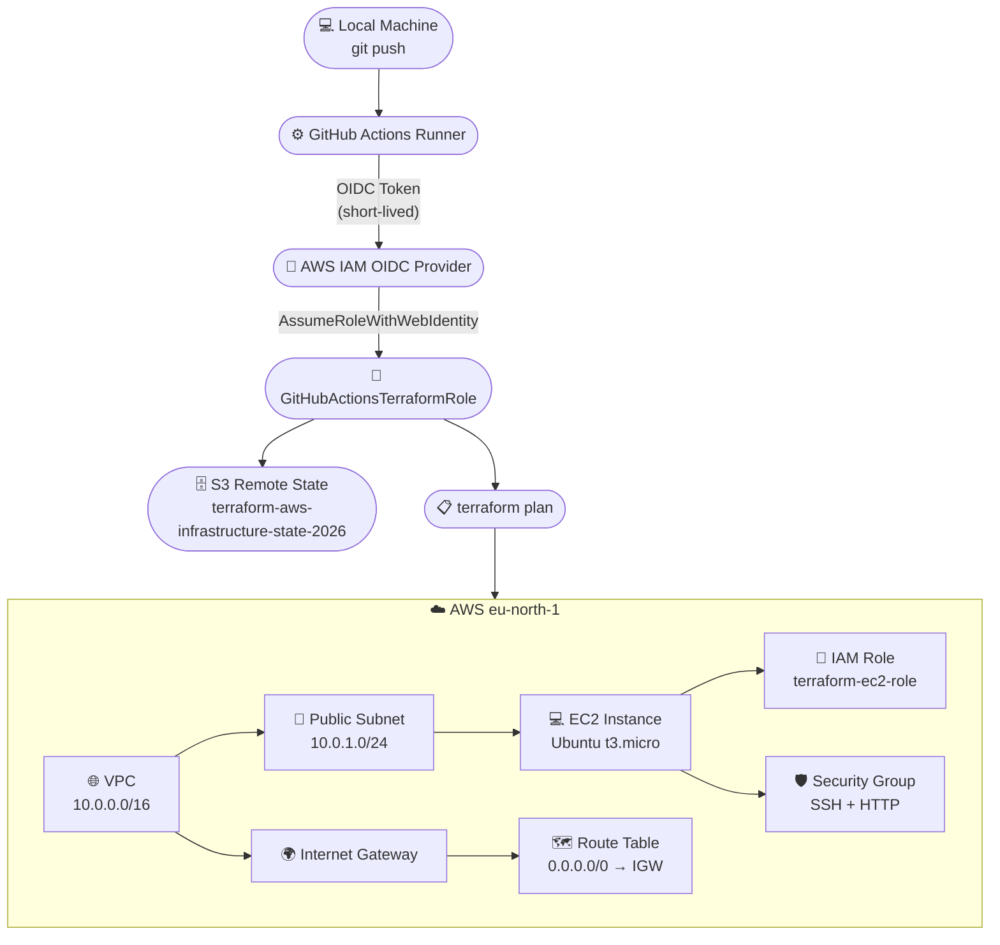
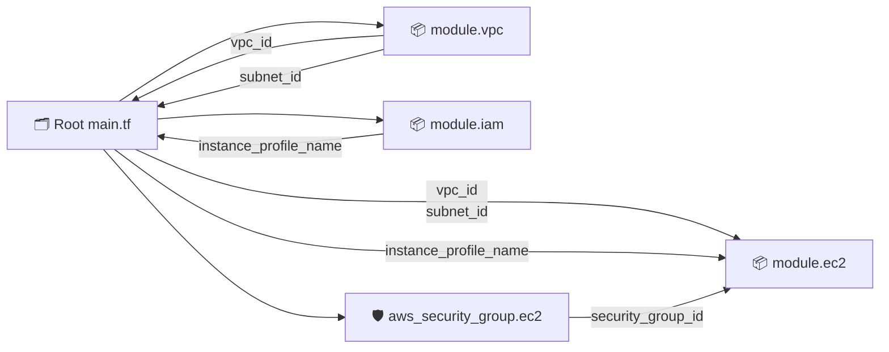
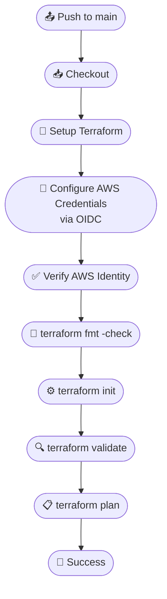
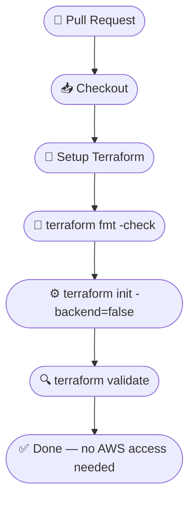
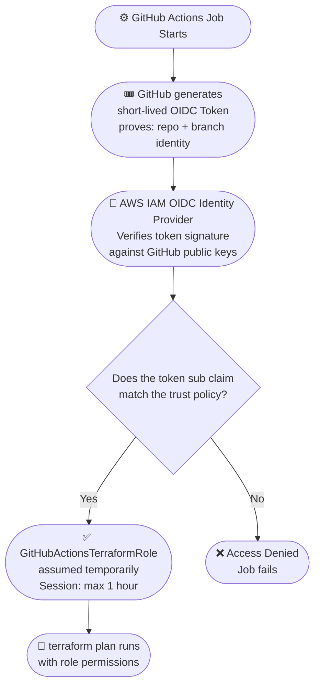

# Terraform AWS Infrastructure

A hands-on DevOps / Infrastructure as Code project where I provision and manage AWS infrastructure with Terraform instead of clicking around in the AWS Console.

It started as a basic root-level setup and slowly grew into a modular configuration with remote state, IAM, and a GitHub Actions CI pipeline that authenticates to AWS through OIDC — no long-lived access keys stored anywhere.

> **Repository:** [terraform-aws-infrastructure](https://github.com/ADDYY27/terraform-aws-infrastructure)

---

## Table of Contents

- [Overview](#overview)
- [What I Built](#what-i-built)
- [Tech Stack](#tech-stack)
- [Architecture](#architecture)
- [Project Structure](#project-structure)
- [AWS Infrastructure](#aws-infrastructure)
- [Terraform Modules](#terraform-modules)
- [Remote State](#remote-state)
- [Getting Started](#getting-started)
- [GitHub Actions CI](#github-actions-ci)
- [AWS OIDC Authentication](#aws-oidc-authentication)
- [Problems I Faced](#problems-i-faced)
- [What I Learned](#what-i-learned)
- [Cleanup](#cleanup)
- [Future Improvements](#future-improvements)

---

## Overview

I built this project to actually learn how Terraform works in practice — not just writing `.tf` files, but dealing with state, modules, IAM permissions, and CI. The idea was simple: stop creating AWS resources manually in the console and manage everything as code.

The project began with a plain root-level configuration. Over time I refactored it into modules, moved the state to an S3 remote backend, added IAM roles, and wired up GitHub Actions so every push to `main` gets validated and planned automatically. Along the way I hit real IAM and OIDC issues, which honestly taught me more than the parts that worked on the first try.

---

## What I Built

**Networking**
- VPC (`10.0.0.0/16`)
- Public subnet (`10.0.1.0/24` in `eu-north-1a`)
- Internet Gateway
- Route table with a `0.0.0.0/0` route to the Internet Gateway
- Route table association

**Compute**
- Ubuntu 24.04 EC2 instance (`t3.micro` by default, configurable via a variable)
- AMI looked up dynamically with a `data` source (latest Canonical Ubuntu Noble image)

**Security**
- Security group allowing SSH (port 22) and HTTP (port 80)
- IAM role for EC2 with an S3 read policy (`s3:GetObject`, `s3:ListBucket`)
- IAM instance profile connecting the role to the EC2 instance

**Terraform State**
- S3 remote backend with versioning, AES256 encryption, and all public access blocked
- State locking via the S3 backend (`use_lockfile`)

**CI/CD**
- GitHub Actions workflow that runs `fmt`, `init`, `validate`, and `plan`
- OIDC-based authentication from GitHub Actions to AWS — no stored AWS keys

---

## Tech Stack

| Tool / Service | What it is used for |
|---|---|
| Terraform (>= 1.6.0) | Infrastructure as Code |
| AWS Provider (~> 6.0) | Talking to AWS APIs |
| AWS (VPC, EC2, IAM, S3) | The actual infrastructure |
| GitHub Actions | CI pipeline |
| GitHub OIDC | Keyless authentication to AWS |
| Region | `eu-north-1` (Stockholm) |

---

## Architecture

### Overall Flow

The general idea: I push code, GitHub Actions picks it up, authenticates to AWS through OIDC, and Terraform manages the infrastructure. State lives in S3, not on my laptop.



---

## Project Structure

This is the actual repository layout:

```
terraform-aws-infrastructure/
│
├── main.tf                  # Root config: module calls, security group, AMI data source, S3 state bucket, moved blocks
├── providers.tf             # Terraform + AWS provider versions, S3 backend config
├── variables.tf             # Root variables (instance_type)
├── outputs.tf               # Root outputs (vpc_id, subnet_id, instance_id, ...)
├── .gitignore               # Ignores .terraform/, state files, etc.
├── .terraform.lock.hcl      # Provider dependency lock file
│
├── modules/
│   │
│   ├── vpc/
│   │   ├── main.tf          # VPC, subnet, IGW, route table, association
│   │   ├── variables.tf
│   │   └── outputs.tf       # vpc_id, subnet_id
│   │
│   ├── ec2/
│   │   ├── main.tf          # The EC2 instance
│   │   ├── variables.tf     # ami_id, instance_type, subnet_id, security_group_id, iam_instance_profile
│   │   └── outputs.tf       # instance_id
│   │
│   └── iam/
│       ├── main.tf          # IAM role, S3 read policy, instance profile
│       ├── variables.tf
│       └── outputs.tf       # role_name, instance_profile_name
│
├── .github/
│   └── workflows/
│       └── terraform.yml    # CI pipeline
│
└── README.md
```

> `.terraform/` exists locally after `terraform init` but is ignored by Git. Terraform state files are also ignored — state lives in the S3 backend, not in the repo.

---

## AWS Infrastructure

### VPC

A single VPC with CIDR `10.0.0.0/16`. Everything else lives inside it.

### Subnet

One public subnet (`10.0.1.0/24`) in the `eu-north-1a` availability zone. It is "public" because its route table sends internet-bound traffic to the Internet Gateway.

### Internet Gateway

Attached to the VPC. Allows resources in the public subnet to talk to the internet.

### Route Table

Contains one important route:

| Destination | Target |
|---|---|
| `0.0.0.0/0` | Internet Gateway |

The route table is associated with the public subnet.

### Security Group

`terraform-ec2-sg`, attached to the EC2 instance:

| Direction | Protocol | Port | Source / Destination |
|---|---|---|---|
| Inbound | TCP | 22 (SSH) | `0.0.0.0/0` |
| Inbound | TCP | 80 (HTTP) | `0.0.0.0/0` |
| Outbound | All | All | `0.0.0.0/0` |

> **Honest note:** SSH is open to the entire internet because this is a learning setup. In anything resembling production, SSH should be restricted to a trusted IP or CIDR range. I know this and it is on the improvements list.

### EC2

An Ubuntu 24.04 instance (`t3.micro` by default) in the public subnet. The AMI is not hardcoded — a `data` source looks up the latest official Canonical Ubuntu Noble image. The instance gets the security group from the root config and the instance profile from the IAM module.

### IAM

- **Role** (`terraform-ec2-role`) — can be assumed by the EC2 service.
- **Policy** — grants `s3:GetObject` and `s3:ListBucket`. This is mainly a learning example of how to attach permissions to an EC2 instance.
- **Instance profile** (`terraform-ec2-profile`) — the glue that connects the role to the EC2 instance.

### S3 Remote State

The bucket `terraform-aws-infrastructure-state-2026` stores Terraform's state with:

| Feature | What it does |
|---|---|
| Versioning enabled | Old state versions are kept, so a bad state can be rolled back |
| AES256 server-side encryption | State is encrypted at rest |
| Public access fully blocked | All four public access block settings are on |

---

## Terraform Modules

The root configuration is split into three modules. Each module has its own `main.tf`, `variables.tf`, and `outputs.tf`.

**VPC module** (`./modules/vpc`) — Creates the VPC, public subnet, Internet Gateway, route table, and route table association. Exposes `vpc_id` and `subnet_id`.

**EC2 module** (`./modules/ec2`) — Creates the EC2 instance. Takes `ami_id`, `instance_type`, `subnet_id`, `security_group_id`, and `iam_instance_profile` as inputs. Exposes `instance_id`.

**IAM module** (`./modules/iam`) — Creates the EC2 role, the S3 read policy, and the instance profile. Exposes `role_name` and `instance_profile_name`.

### Module Wiring



### A Note on `moved` Blocks

The resources didn't start out in modules. Originally the VPC, subnet, EC2 instance, IAM role, etc. were defined directly in the root config. When I refactored them into modules, Terraform would have seen the old resources as "deleted" and the module resources as "new" — meaning it would try to destroy and recreate everything.

To avoid that, I used `moved` blocks:

```hcl
moved {
  from = aws_vpc.main
  to   = module.vpc.aws_vpc.main
}
```

This told Terraform "this is the same resource, just at a new address," so it updated the state instead of recreating real infrastructure.

---

## Remote State

Terraform state contains real information about the infrastructure, so keeping it only on my local machine was not a great idea.

State is stored remotely in S3 and encrypted. `use_lockfile` gives state locking, so two runs cannot step on each other. Versioning on the bucket means previous state versions are recoverable.

| Config | Value |
|---|---|
| Bucket | `terraform-aws-infrastructure-state-2026` |
| Key | `terraform.tfstate` |
| Region | `eu-north-1` |
| Encryption | `true` (AES256) |
| Locking | `use_lockfile = true` (S3 native, no DynamoDB needed) |

> One caveat: since the state bucket is the backend, it should not be casually destroyed while Terraform is using it.

---

## Getting Started

### Prerequisites

- Terraform >= 1.6.0
- An AWS account and credentials configured locally
- An S3 bucket for remote state (or use the one defined in `providers.tf`)

### Steps

```bash
# Clone the repo
git clone https://github.com/ADDYY27/terraform-aws-infrastructure.git
cd terraform-aws-infrastructure

# Initialize Terraform (connects to the S3 backend)
terraform init

# Check formatting and syntax
terraform fmt -check -recursive
terraform validate

# See what would be created or changed
terraform plan

# Apply
terraform apply
```

The only root variable is `instance_type` (default `t3.micro`). Override it if needed:

```bash
terraform apply -var="instance_type=t3.small"
```

---

## GitHub Actions CI

The workflow lives in `.github/workflows/terraform.yml` and behaves differently depending on the trigger.

### On Push to Main



### On Pull Requests

PRs intentionally do not get AWS credentials. They run a lighter check:



The point: code from a PR gets syntax-checked, but never gets access to my AWS account.

### Final CI Result

After all the troubleshooting (see below), the pipeline completed successfully with:

```
Plan: 0 to add, 0 to change, 0 to destroy.
```

That "zero changes" is a good thing — it means the code in the repo and the actual AWS infrastructure are in sync.

---

## AWS OIDC Authentication

Instead of storing `AWS_ACCESS_KEY_ID` and `AWS_SECRET_ACCESS_KEY` as GitHub secrets (which would be long-lived credentials sitting with a third party), GitHub Actions authenticates through OIDC.

### OIDC Flow



### How it Works

1. The workflow requests an OIDC token from GitHub (audience: `sts.amazonaws.com`).
2. AWS has an IAM OIDC provider configured for `https://token.actions.githubusercontent.com`.
3. The IAM role `GitHubActionsTerraformRole` has a trust policy that restricts which GitHub repository and branch is allowed to assume it.
4. If the token matches, AWS issues short-lived credentials. Nothing long-lived is stored anywhere.

The role's inline policy (`GitHubActionsTerraformRolePolicy`) is read-oriented:

| Permission Group | What it covers |
|---|---|
| `TerraformStateAccess` | S3 state read/write + `s3:GetBucket*` scoped to the state bucket |
| `TerraformEC2Read` | `ec2:Describe*` — read-only, no mutations possible |
| `TerraformIAMRead` | `iam:GetRole`, `iam:GetRolePolicy`, `iam:GetInstanceProfile`, `iam:ListRolePolicies`, `iam:ListAttachedRolePolicies` |

---

## Problems I Faced

This is the part where most of the actual learning happened.

### 1. OIDC Authentication Failure

**Problem:** GitHub Actions could not authenticate with AWS at all.

```
Could not assume role with OIDC: the web identity token provided could not be validated.
```

**Why:** AWS did not have the GitHub OIDC provider configured yet, so it had no way to validate GitHub's token.

**Fix:** Created the GitHub Actions OIDC provider in AWS IAM (`token.actions.githubusercontent.com`, audience `sts.amazonaws.com`).

**Result:** Authentication moved forward — and immediately revealed the next problem.

---

### 2. IAM Trust Policy

**Problem:**

```
Not authorized to perform sts:AssumeRoleWithWebIdentity
```

**Why:** GitHub was presenting a valid identity, but the IAM role's trust policy did not authorize that identity (my repo and branch) to assume the role.

**Fix:** Corrected the trust policy so it matches the repository and branch identity that GitHub presents in the token.

**Result:** GitHub Actions could finally assume the AWS role successfully.

---

### 3. Terraform AccessDenied During Refresh

**Problem:** Authentication worked, but `terraform plan` started failing during the refresh phase with errors like:

```
s3:GetBucketPolicy, s3:GetBucketAcl, s3:GetBucketCORS,
s3:GetBucketWebsite, s3:GetBucketRequestPayment,
s3:GetLifecycleConfiguration, s3:GetReplicationConfiguration
```

**Why:** I initially thought `plan` just compares `.tf` files to the state. It does not — Terraform first refreshes the real AWS resources, which means API calls, which means IAM permission checks. The CI role could authenticate but did not have all the read permissions Terraform needed.

**Fix:** At first I fixed permissions one at a time — run, hit a missing permission, add it, run again, hit the next one. Very whack-a-mole. Eventually I stepped back and analyzed it systematically, switching to broader read patterns where appropriate (`s3:GetBucket*`, `ec2:Describe*`) plus the specific actions Terraform actually needs.

**Result:** Before rerunning CI, I verified the live IAM policy: JSON valid, all expected permissions present, no unexpected ones. After that the pipeline ran green.

---

### 4. Module Refactoring Without Destroying Infrastructure

**Problem:** I wanted to move root-level resources into modules, but Terraform saw that as "delete the old resource, create a new one."

**Why:** Terraform tracks resources by their address in state. `aws_vpc.main` and `module.vpc.aws_vpc.main` are different addresses, even if they mean the same real-world VPC.

**Fix:** Used `moved` blocks to map the old addresses to the new module addresses.

**Result:** Terraform updated its state addresses and left the actual AWS infrastructure untouched.

---

## What I Learned

**Terraform:** providers, resources, data sources, variables, outputs, modules, state, remote backends, `moved` blocks, and the `fmt` / `validate` / `plan` workflow. Also the important detail that `plan` refreshes real infrastructure first, which is why read permissions matter.

**AWS:** VPCs, subnets, internet gateways, route tables, security groups, EC2, IAM (roles, trust policies, instance profiles), and S3 (versioning, encryption, public access blocks).

**DevOps:** Infrastructure as Code, CI/CD with GitHub Actions, OIDC-based authentication, IAM trust relationships, and how to debug `AccessDenied` errors methodically instead of guessing.

---

## Cleanup

These are real AWS resources and they cost money:

- **Stop the EC2 instance** when not working on the project. A stopped instance does not bill for compute, but the attached EBS storage still does.
- **Check for stragglers** — make sure no NAT Gateway, Elastic IP, Load Balancer, or RDS instance is running unintentionally. (This project does not create any of those, but it is a good habit.)

When the project is completely done:

```bash
terraform destroy
```

> Review the plan carefully before confirming. And remember: the S3 state bucket is Terraform's own backend — do not destroy it while it is still being used as the backend.

---

## Future Improvements

Things I would like to add or fix when I come back to this:

- Restrict SSH access to a specific IP/CIDR instead of `0.0.0.0/0`
- Add a private subnet and learn how NAT gateways work
- Add `terraform apply` to the pipeline (currently it is validate/plan only, applied manually)
- Parameterize more values (CIDR blocks, region, AZ) instead of hardcoding them
- Add automated cost checks (e.g., Infracost) to the CI pipeline
- Tighten the GitHub Actions IAM policy further toward least privilege
