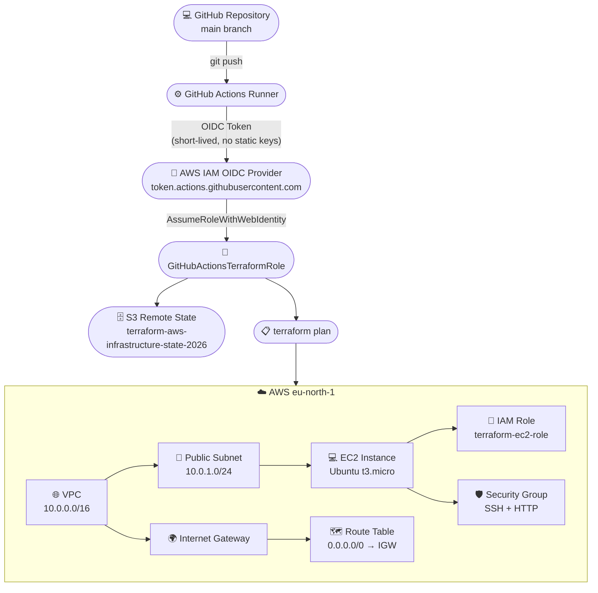
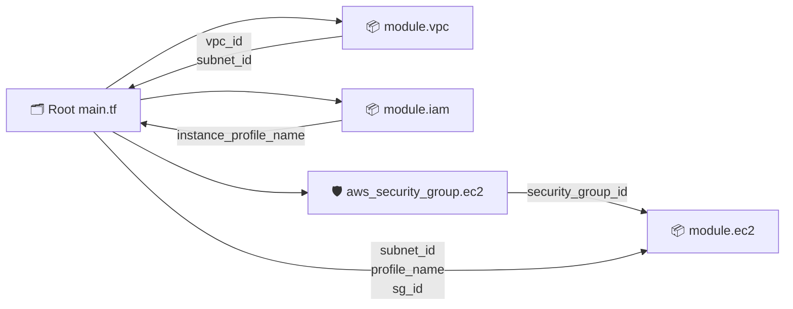
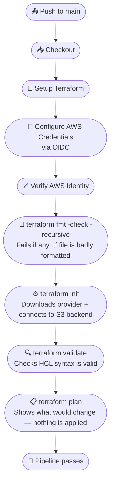
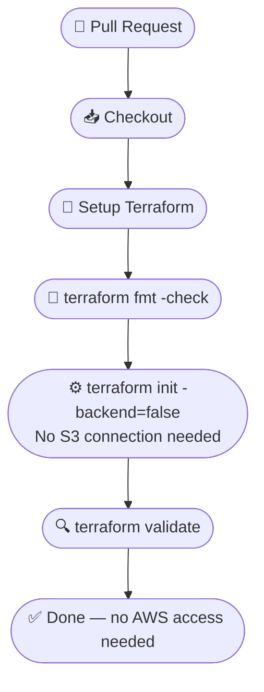
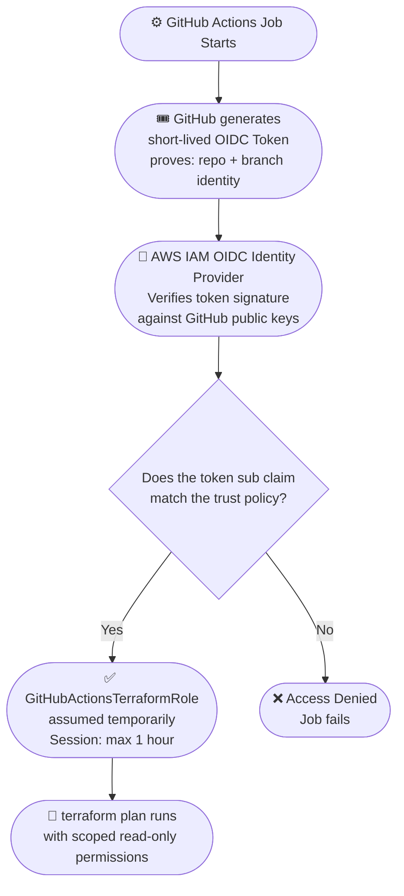

# Terraform AWS Infrastructure

A hands-on DevOps / Infrastructure as Code project where I provision and manage real AWS infrastructure with Terraform — instead of clicking around in the AWS Console.

It started as a basic root-level setup and slowly grew into a modular configuration with remote state, IAM roles, and a GitHub Actions CI pipeline that authenticates to AWS through OIDC. No long-lived access keys stored anywhere.

> **Repository:** [terraform-aws-infrastructure](https://github.com/ADDYY27/terraform-aws-infrastructure) &nbsp;|&nbsp; **Region:** `eu-north-1` (Stockholm) &nbsp;|&nbsp; **Provider:** AWS `~> 6.0` (locked at `6.67.0`)

---

## Table of Contents

- [Overview](#overview)
- [What I Built](#what-i-built)
- [Tech Stack](#tech-stack)
- [Architecture](#architecture)
- [Project Structure](#project-structure)
- [AWS Infrastructure](#aws-infrastructure)
- [Terraform Modules](#terraform-modules)
- [Remote State](#remote-state)
- [GitHub Actions CI](#github-actions-ci)
- [AWS OIDC Authentication](#aws-oidc-authentication)
- [IAM Permissions for GitHub Actions](#iam-permissions-for-github-actions)
- [Problems I Faced](#problems-i-faced)
- [Getting Started](#getting-started)
- [What I Learned](#what-i-learned)
- [Cleanup](#cleanup)
- [Future Improvements](#future-improvements)

---

## Overview

I built this project to actually learn how Terraform works in practice — not just writing `.tf` files, but dealing with state, modules, IAM permissions, and CI. The idea was simple: stop creating AWS resources manually in the console and manage everything as code.

The project began with a plain root-level configuration. Over time I refactored it into modules, moved the state to an S3 remote backend, added IAM roles, and wired up GitHub Actions so every push to `main` gets validated and planned automatically.

Along the way I hit real IAM and OIDC issues, which honestly taught me more than the parts that worked on the first try.

---

## What I Built

| Area | What I Implemented |
|---|---|
| Networking | VPC, Public Subnet, Internet Gateway, Route Table, Route Table Association |
| Compute | Ubuntu 24.04 EC2 instance (`t3.micro`, configurable via variable) |
| Security | Security Group with SSH (22) and HTTP (80) ingress rules |
| Identity | IAM Role, Inline S3 Read Policy, Instance Profile |
| State Management | S3 Remote Backend with versioning, AES256 encryption, public access blocking |
| Modules | Separate `vpc`, `ec2`, and `iam` Terraform modules |
| CI/CD | GitHub Actions — `fmt`, `init`, `validate`, `plan` on every push to `main` |
| Authentication | GitHub OIDC — no static AWS access keys stored anywhere |

---

## Tech Stack

| Tool / Service | Version / Notes |
|---|---|
| Terraform | >= 1.6.0 |
| AWS Provider | ~> 6.0 (locked at 6.67.0) |
| AWS Region | `eu-north-1` (Stockholm) |
| EC2 AMI | Ubuntu 24.04 LTS — looked up dynamically, not hardcoded |
| Instance Type | `t3.micro` (overridable via `instance_type` variable) |
| Remote State | AWS S3, `use_lockfile = true` (no DynamoDB needed) |
| CI | GitHub Actions |
| Auth | AWS IAM OIDC Identity Provider |

---

## Architecture

### Overall Flow

The general idea: push code → GitHub Actions picks it up → authenticates to AWS through OIDC → Terraform reads remote state from S3 and plans the infrastructure. Nothing is applied automatically.



---

## Project Structure

```
terraform-aws-infrastructure/
│
├── main.tf                  # Root config: module calls, security group, AMI data source, S3 bucket, moved blocks
├── providers.tf             # Terraform + AWS provider versions, S3 backend config
├── variables.tf             # Root variables (instance_type)
├── outputs.tf               # Root outputs (vpc_id, subnet_id, instance_id, ...)
├── .gitignore               # Ignores .terraform/, *.tfstate, *.tfvars
├── .terraform.lock.hcl      # Provider dependency lock file
│
├── modules/
│   ├── vpc/
│   │   ├── main.tf          # VPC, subnet, IGW, route table, association
│   │   ├── variables.tf
│   │   └── outputs.tf       # vpc_id, subnet_id
│   │
│   ├── ec2/
│   │   ├── main.tf          # EC2 instance
│   │   ├── variables.tf     # ami_id, instance_type, subnet_id, security_group_id, iam_instance_profile
│   │   └── outputs.tf       # instance_id
│   │
│   └── iam/
│       ├── main.tf          # IAM role, S3 read policy, instance profile
│       ├── variables.tf
│       └── outputs.tf       # role_name, instance_profile_name
│
├── .github/
│   └── workflows/
│       └── terraform.yml    # CI pipeline
│
└── README.md
```

> `.terraform/` is created locally after `terraform init` but is git-ignored. State files are also ignored — state lives in the S3 backend, not in the repo.

---

## AWS Infrastructure

### VPC

A single VPC with CIDR `10.0.0.0/16`. Everything else lives inside it. Without a custom VPC, resources would land in the default AWS network, which is not great for isolation or control.

### Public Subnet

One public subnet (`10.0.1.0/24`) in the `eu-north-1a` availability zone. The EC2 instance goes here because it needs to be internet-accessible.

### Internet Gateway

Attached to the VPC. Without this, the VPC is fully isolated — nothing can reach the EC2 instance even if the subnet is configured correctly.

### Route Table

Contains one route that sends all outbound traffic (`0.0.0.0/0`) to the Internet Gateway. The route table is then associated with the public subnet. This is what actually makes a subnet "public."

| Destination | Target |
|---|---|
| `0.0.0.0/0` | Internet Gateway |

### Security Group

`terraform-ec2-sg`, attached to the EC2 instance:

| Direction | Protocol | Port | Source / Destination |
|---|---|---|---|
| Inbound | TCP | 22 (SSH) | `0.0.0.0/0` |
| Inbound | TCP | 80 (HTTP) | `0.0.0.0/0` |
| Outbound | All | All | `0.0.0.0/0` |

> **Note:** SSH is open to the entire internet because this is a learning project. In anything production-like, SSH should be restricted to a specific IP or CIDR. This is on the improvements list.

### EC2 Instance

A `t3.micro` Ubuntu 24.04 LTS instance in the public subnet. The AMI is not hardcoded — a `data` source looks up the latest official Canonical Ubuntu Noble image at plan time:

```hcl
data "aws_ami" "ubuntu" {
  most_recent = true
  owners      = ["099720109477"]  # Canonical

  filter {
    name   = "name"
    values = ["ubuntu/images/hvm-ssd-gp3/ubuntu-noble-24.04-amd64-server-*"]
  }
}
```

The instance gets the security group from the root config and the instance profile from the IAM module.

### IAM Role and Instance Profile

- **Role** (`terraform-ec2-role`) — can be assumed by the EC2 service (`ec2.amazonaws.com`)
- **Policy** — grants `s3:GetObject` and `s3:ListBucket` as an example of attaching permissions to an EC2 instance
- **Instance Profile** (`terraform-ec2-profile`) — the required wrapper that lets EC2 use an IAM role. AWS won't let you attach a role directly to an instance, only via a profile.

---

## Terraform Modules

Originally everything was in a single root `main.tf`. Once things grew, I refactored into three modules — each with its own folder, `main.tf`, `variables.tf`, and `outputs.tf`.

| Module | What it manages |
|---|---|
| `modules/vpc` | VPC, Subnet, Internet Gateway, Route Table, Association |
| `modules/ec2` | EC2 Instance |
| `modules/iam` | IAM Role, Inline Policy, Instance Profile |

### Module Wiring

The root `main.tf` calls each module and passes outputs between them. For example, the EC2 module needs a `subnet_id` from the VPC module and a `security_group_id` from the root module:



### `moved` Blocks

When I refactored root resources into modules, Terraform would have treated the old addresses as deleted and the new module addresses as brand new — destroying my VPC and EC2 instance in the process.

`moved` blocks prevent this:

```hcl
moved {
  from = aws_vpc.main
  to   = module.vpc.aws_vpc.main
}
```

This tells Terraform the resource is the same physical thing in AWS — just at a new address in the state file. Terraform updates state only, without touching real infrastructure.

During `terraform plan` this appears as `"has moved to module..."` — that is expected and means nothing was destroyed.

---

## Remote State

By default Terraform stores state in a local `terraform.tfstate` file. That breaks down as soon as you add CI — GitHub Actions has no access to your laptop.

I moved state to S3:

| Config | Value |
|---|---|
| Bucket | `terraform-aws-infrastructure-state-2026` |
| Key | `terraform.tfstate` |
| Region | `eu-north-1` |
| Encryption | `true` (AES256) |
| Locking | `use_lockfile = true` — S3-native, no DynamoDB table needed |

The bucket itself is also hardened:

| Feature | Why I added it |
|---|---|
| **Versioning** | Every state write is versioned — bad state can be rolled back |
| **AES256 Encryption** | State contains resource IDs and config details — should always be encrypted at rest |
| **Public Access Blocking** | All four public access block settings are on — bucket is fully private |

> **One caveat:** The S3 bucket is Terraform's own backend. Do not destroy it while it is still being used as the backend.

---

## GitHub Actions CI

The workflow lives in `.github/workflows/terraform.yml` and runs automatically on pushes to `main`.

### Push to Main — Full Pipeline



### Pull Request — Lightweight Check

PRs intentionally do not get AWS credentials. They run a lighter validation only:



The point: PRs get syntax-checked, but never get access to the AWS account.

### Final CI Result

After all the troubleshooting described below, the pipeline completed successfully with:

```
Plan: 0 to add, 0 to change, 0 to destroy.
```

Zero changes is the right answer — it confirms the code and the real AWS infrastructure are in sync.

---

## AWS OIDC Authentication

I did not want to store long-lived AWS access keys in GitHub Secrets. If a key leaked, it would be valid indefinitely until someone manually rotated it.

Instead I used OpenID Connect (OIDC). GitHub generates a short-lived signed token for each job. AWS verifies it. The role is assumed temporarily. No keys to store, nothing to rotate, nothing to revoke.

### OIDC Authentication Flow



### What I Set Up

Three things needed to be in place:

1. **IAM OIDC Identity Provider** — registered `token.actions.githubusercontent.com` in AWS IAM so AWS knows how to validate GitHub-signed tokens.
2. **Trust Policy on the Role** — restricted to my specific repository and branch using the `sub` claim. Even if someone forks the repo, they cannot assume my role.
3. **Workflow Permission** — added `permissions: id-token: write` to the GitHub Actions workflow so GitHub actually generates the OIDC token for the job.

---

## IAM Permissions for GitHub Actions

The `GitHubActionsTerraformRole` uses a least-privilege inline policy (`GitHubActionsTerraformRolePolicy`) with exactly three permission groups:

| Statement | What it allows | Why it is needed |
|---|---|---|
| `TerraformStateAccess` | Read/write the S3 state file; `s3:GetBucket*` scoped to the state bucket | Terraform reads and updates remote state, and refreshes the `aws_s3_bucket` resource attributes during plan |
| `TerraformEC2Read` | `ec2:Describe*` on all resources | Terraform refreshes VPC, subnet, EC2, security group, and route table before planning. AWS does not allow resource-level restrictions on Describe calls |
| `TerraformIAMRead` | `iam:GetRole`, `iam:GetRolePolicy`, `iam:GetInstanceProfile`, `iam:ListRolePolicies`, `iam:ListAttachedRolePolicies` | Terraform reads the managed IAM role and instance profile during refresh |

The role can **read** existing infrastructure to detect drift, and can **read/write** the state file. It cannot create, modify, or destroy any AWS resource. `terraform apply` is always run manually with a different set of credentials.

---

## Problems I Faced

This is the part where most of the actual learning happened.

### 1. OIDC Authentication Failure

**Problem:** GitHub Actions kept failing at the "Configure AWS Credentials" step.

```
Could not assume role with OIDC: the web identity token provided could not be validated.
```

**Why it happened:** The GitHub OIDC Identity Provider did not exist in AWS yet, so AWS had no way to validate the token. The role's trust policy also had an incorrect `sub` claim format.

**What I did:**
- Created the OIDC Identity Provider in AWS IAM for `token.actions.githubusercontent.com`
- Fixed the trust policy `sub` claim to match GitHub's format for my specific repo and branch

**Result:** Authentication started working. The workflow could assume the role and get temporary credentials.

---

### 2. IAM Trust Policy Rejection

**Problem:** GitHub was presenting a valid token, but got rejected:

```
Not authorized to perform sts:AssumeRoleWithWebIdentity
```

**Why it happened:** The trust policy conditions did not match the identity GitHub was presenting (repo name, branch).

**Fix:** Corrected the trust policy to match the exact `sub` claim GitHub sends.

**Result:** Role assumption worked. Credentials were issued. Then the next problem appeared.

---

### 3. Terraform Plan Failing with AccessDenied

**Problem:** Once auth worked, `terraform plan` started failing with a sequence of `AccessDenied` errors:

```
s3:GetBucketPolicy
s3:GetBucketAcl
s3:GetBucketCORS
s3:GetBucketWebsite
ec2:DescribeVpcAttribute
iam:ListRolePolicies
```

**Why it happened:** During `terraform plan`, Terraform first *refreshes* every managed resource by making live AWS API calls — not just comparing `.tf` files to the state file. The AWS provider (v6.67.0) calls many read APIs including ones for bucket settings I never explicitly configured (CORS, website hosting, lifecycle, etc.).

The tricky part: Terraform stops completely on the first `AccessDenied`. So each CI run reveals only the *next* missing permission. I could not see them all at once.

**First approach:** Fix one permission, push, fail on the next. Repeat. Slow and frustrating — 5+ CI runs just to discover all the missing permissions.

**Better approach:** I stepped back and redesigned the policy systematically:
- For S3: use `s3:GetBucket*` to cover all read-only bucket property lookups at once
- For EC2: use `ec2:Describe*` — all Describe calls are read-only and AWS does not allow resource-level restrictions on them anyway
- For IAM: keep only the specific `Get*` and `List*` calls Terraform actually needs

This resolved all refresh-phase errors in one policy update without granting any write permissions.

**Result:** Before rerunning CI, I verified the live policy in AWS was valid and complete. The pipeline ran green.

---

### 4. Module Refactoring Without Destroying Infrastructure

**Problem:** After moving resources into modules, `terraform plan` showed a wall of `"has moved to module..."` messages. I was not sure if it was going to destroy everything.

**Why it happened:** Terraform tracks every resource by its address in the state file. `aws_vpc.main` and `module.vpc.aws_vpc.main` look like completely different resources to Terraform. Without guidance, it would delete the old one and create a new one — destroying the real VPC and EC2 instance.

**What I did:** Added `moved {}` blocks for every resource that changed address:

```hcl
moved {
  from = aws_vpc.main
  to   = module.vpc.aws_vpc.main
}
```

**Result:** `Plan: 0 to add, 0 to change, 0 to destroy.` — Terraform updated the state addresses and left the real AWS infrastructure completely untouched.

---

## Getting Started

> **Note:** This project provisions real AWS resources that may incur costs. Make sure you have an AWS account and appropriate permissions before proceeding.

### Prerequisites

- [Terraform](https://www.terraform.io/downloads) >= 1.6.0
- AWS CLI installed and configured (`aws configure`)
- An S3 bucket for remote state (or update `providers.tf` to use a local backend for testing)

### Steps

```bash
# Clone the repo
git clone https://github.com/ADDYY27/terraform-aws-infrastructure.git
cd terraform-aws-infrastructure

# Initialize Terraform (downloads provider, connects to S3 backend)
terraform init

# Check formatting
terraform fmt -check -recursive

# Validate syntax
terraform validate

# Preview what would change
terraform plan

# Apply (manual only — CI never runs apply)
terraform apply

# Destroy when done
terraform destroy
```

The only root variable is `instance_type` (default `t3.micro`). Override it if needed:

```bash
terraform apply -var="instance_type=t3.small"
```

> The GitHub Actions CI only runs `terraform plan`. Applying and destroying are always done manually.

---

## What I Learned

**Terraform state is everything.** If the state file is lost or corrupted, Terraform loses track of what it owns. Using S3 as a remote backend with versioning and encryption is not optional in any real project — it is the baseline.

**`moved` blocks are the right tool for refactoring.** Restructuring code into modules feels risky because changing a resource's address looks like a deletion. Once I understood what `moved` blocks actually do, refactoring became a lot less stressful.

**OIDC is the right way to authenticate CI to AWS.** Static access keys stored in GitHub Secrets are valid indefinitely until manually rotated. OIDC tokens expire within an hour. There is nothing to clean up if something goes wrong.

**Terraform's AWS provider reads far more than you expect during refresh.** The provider checks every attribute of every managed resource — including CORS settings, website hosting config, lifecycle policies, and instance attributes — before calculating a plan. When building the IAM policy for a CI role, granting `ec2:Describe*` and `s3:GetBucket*` upfront is the right call. Guessing which specific API calls the provider makes is a slow, painful process.

**Least privilege is about understanding what is needed, not minimizing everything blindly.** The goal is to grant exactly what the tool needs and nothing more. Getting there requires understanding what the tool actually does under the hood.

**Terraform stops on the first error.** This sounds obvious, but it has a real consequence for IAM work: you can never see all the missing permissions in one run. The systematic `Describe*` / `GetBucket*` approach exists precisely because of this limitation.

---

## Cleanup

These are real AWS resources that cost money:

- **Stop the EC2 instance** when not working on the project. A stopped instance does not bill for compute, but the EBS volume still does.
- **Check for stragglers** — this project does not create NAT Gateways, Elastic IPs, or Load Balancers, but it is a good habit to verify.

When completely done:

```bash
terraform destroy
```

Review the destroy plan carefully before confirming. Do **not** destroy the S3 state bucket while it is still configured as Terraform's backend.

---

## Future Improvements

- Restrict SSH access to a specific IP/CIDR instead of `0.0.0.0/0`
- Add a private subnet and learn how NAT Gateways work
- Add `terraform apply` to the CI pipeline (gated behind a manual approval step)
- Parameterize CIDR blocks, region, and availability zone instead of hardcoding them
- Add automated cost estimation (e.g., [Infracost](https://www.infracost.io/)) to the CI pipeline
- Tighten the GitHub Actions IAM policy even further toward least privilege
